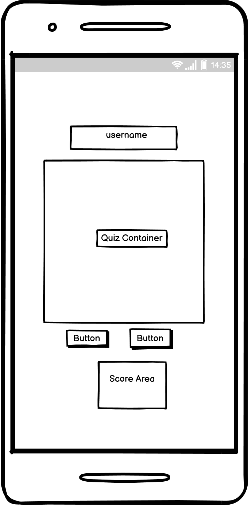

# Bible Quiz for Kids

This project is focused on a quiz app for kids to test their knowledge on the just concluded bible project.

The users should be able to get an average score if they have have truly taken the lessons

The idea behind the quiz is to test their knowledge on the short bible project.

https://kiksgold.github.io/Bible-Quiz-for-Kids/

## Our Main goal:
<ul>
<li> to ascertain the effectiveness of the bible project lesson.
<li> to test the kids knowledge
</ul>

### Content Strategy
<ul>
<li> user-friendly
<li> easy to use navigations
</ul>

### Target Audience:
Our bible quiz is targeted at kids that has gone through a bible project lesson and may want to test their knowledge.

## Wireframes

## Features:
<ul>
<li> Header
    <ul>
    <li>The header features at the top of the page stating the Bible Quiz for Kids</li>
    <li>It clearly tells the user, the type of quiz and who its meant for</li> 
    </ul>

<li> Username 
    <ul>
    <li>The Quiz requires a username before they can start the quiz</li>
    <li> The Quiz will not start if no name is supplied with an alert of "Invalid Username"</li>
    </ul>

<li> Quiz Area
    <ul>
    <li>This is the question and answer area</li>
    <li>The Quiz area is hidden until the username is supplied</li>
    <li>This is the Quiz area, a set of question and options are supplied.</li>
    <li> The user is expected to choose an option </li>
    <li> Once an option is chosen, the correct anser is highlighted green, while the wrong answer is highlighted red.</li>
    <li> The other options are greyed out such that the user cannot pick another option again.</li>
    </ul>

<li> Control Area
    <ul>
    <li>The control area has two buttons: "Start" and "Next"</li>
    <li>Once the game is started, the start button is hidden</li>
    <li>The next button supplies the next question and ends the game when it gets to the last question</li>
    </ul>

<li> Score Area
    <ul>
    <li>The score area records the correct and incorrect answers</li>
    <li> It gives the total score of the quiz</li>
    <li> It ends the game when the total score equals to total questions</li>
    </ul>

</ul>

## Testing
<ul>
<li> The quiz works in different browser; Chrome, Safari, and my mobile device (iPhone11). </li>
<li> I confirm that this quiz is responsive, looks good and functions on all standard screen sizes using devtools device toolbar. </li>
<li> I have used the http://ami.responsivedesign.is/ website to check the render on different sceens. </li>
<li> I have tested that the header, quiz area, control buttons and score area works well </li>
</ul>

## Challenge / Bugs
### Solved Bugs
<li>My questions were repeating multiple times, i was able to use the splice method on my question array to display a question once</li>
<li>On completing that, my choice buttons were given the wrong answer, I then set a global variable for currentAnswer</li>
<li>My score area was counting from zero, i realized that my counter was not properly aligned</li>

## Validator Testing
<ul>
<li>HTML </li>
<ul>
<li> No errors were returned when passing through the official W3C validator. </li>
</ul>
<li>CSS </li>
<ul>
<li> No errors were returned when passing through the official W3C validator. </li>
</ul>
<li>JavaScripts</li>
<ul>
<li>No errors were returned when passed through JSHint Validator </li>
</ul>
</ul>

## Deployment
The site was deployed to GitHub Page. The following steps were taken for deployment:
<ul>
<li> I created a repository on mygithub </li>
<li> I have saved, commited and pushed every changes to github.</li>
<li>In the github repository I navigated to the settings tab </li> 
<li> I used the drop-down menu to select master branch as a publishing source and saved it. </li>
<li> Refreshed the github page, and a link was provided to the completed website

https://kiksgold.github.io/Bible-Quiz-for-Kids/
</ul>

## Credits
<ul>
<li>Tutor Support</li>
<li>w3schools</li>
<li>Youtube Videos</li>
</ul>

## Media
<li>No media was used</li>